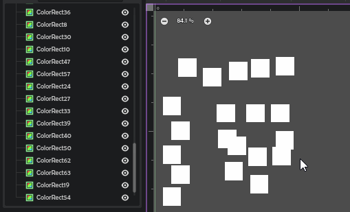
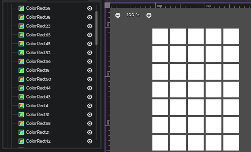

# Auto Layout

Need a container? Select nodes, press `Shift+A`.

- Keep pressing `A` to keep choosing containers from the list
- Picks the most appropriate containers for the layout of the nodes
- Grids choose column count automatically

- Delete Node dialog now lets you delete while keeping children! Great to get rid of these containers.
- After `Shift+A`, press `Escape` to cancel
- After `Shift+A`, press `R` to replace the old parent with the chosen container

#
Made by Don Tnowe in 2023.

[My Website](https://redbladegames.netlify.app)

[Itch](https://don-tnowe.itch.io)

[Twitter](https://twitter.com/don_tnowe)

Copying and Modification is allowed in accordance to the MIT license, full text is included.
